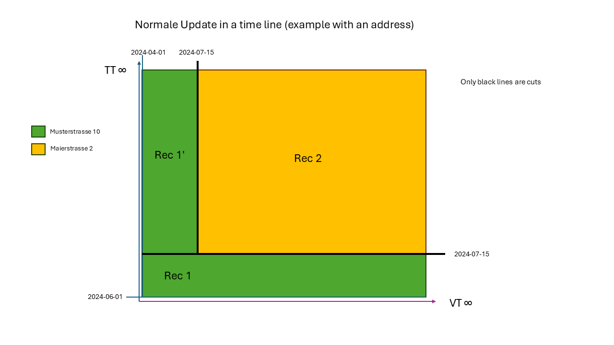
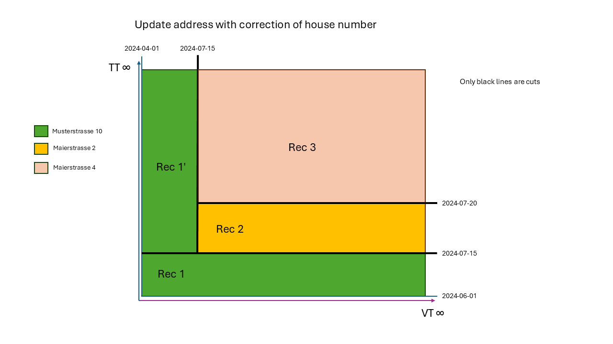
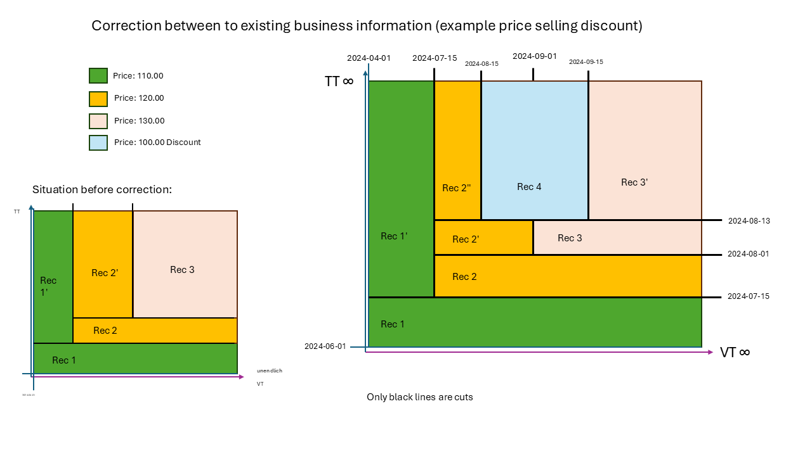

# Bi-Temporal (Valid Time + Transaction Time Versioning)

## What is bi-temporal storage?

A normal database table stores only the **current state** of a record. When you update or delete a record, the previous values are gone forever.

**Temporal storage** preserves every version. Every change creates a new entry — the old one remains intact and queryable.

**Bi-temporal** goes one step further by tracking **two independent time axes**:

| Column pair | Axis | Question answered |
|-------------|------|------------------|
| `valid_from` / `valid_to` | **Valid Time (VT)** | When was this fact true in the real world? |
| `known_from` / `known_to` | **Transaction Time (TT)** | When did the system record this? |

Both axes use a max-sentinel (`9999-12-31` for VT, `9999-12-31 23:59:59` for TT) to mark an open end.

---

## The 2D space: rectangles, not rows

Each record occupies a **rectangle** in the 2D space of VT × TT. The fundamental rule: rectangles for the same entity must **tile the space without gaps** — every point (TT moment, VT moment) must be covered by exactly one record.

```
TT ∞ │                                              │
     │  Rec 1' (Musterstr.)   │  Rec 2 (Maierstr.) │
     │  VT: Apr 01 → Jul 14   │  VT: Jul 15 → ∞    │
     │  TT: Jul 15 → ∞        │  TT: Jul 15 → ∞    │
Jul 15├──────────────────────────────────────────────┤
     │  Rec 1  (Musterstrasse 10)                    │
     │  VT: Apr 01 → ∞    TT: Jun 01 → Jul 14       │
Jun 01└──────────────────────────────────────────────┘
      Apr 01              Jul 15                  VT ∞
```

Rec 1' (the **remainder**) and Rec 2 are both TT-open and together cover all VT periods. This ensures every historical question can be answered.

### Why the naive approach creates gaps

A common mistake: when updating an address, close the old record on **both** axes simultaneously (VT and TT), then insert a new record starting from the new `valid_from`.

Query: *"What address was known for May 15, as of August?"*
- Rec 1: `known_to = Jul 14 < August` → not visible
- Rec 2: `valid_from = Jul 15 > May 15` → wrong VT range

**No result** — a gap in the 2D space. The correct approach creates Rec 1' as a **remainder copy** that covers the old VT period with current TT knowledge.

---

## Installation

```bash
composer require guggach/laravel-db-temporal
```

```bash
php artisan temporal:install   # adds temporal-proxy connection to config/database.php
php artisan temporal:uninstall # reverts
```

See the [README](../README.md) for full installation details.

---

## Configuration

### Connection-based (`DB::table()`) — recommended

```php
// config/database.php
'default' => env('DB_CONNECTION', 'temporal'),

'connections' => [
    'temporal' => [
        'driver' => 'temporal-proxy',
        'base'   => 'mysql',  // or: pgsql, sqlite

        'bi-temporal' => [
            'defaults' => [
                'column_valid_from' => 'valid_from',
                'column_valid_to'   => 'valid_to',
                'column_known_from' => 'known_from',
                'column_known_to'   => 'known_to',
                'vt_precision'      => 'day',                  // 'day' or 'datetime'
                'max_date'          => '9999-12-31',           // VT sentinel
                'max_timestamp'     => '9999-12-31 23:59:59',  // TT sentinel
            ],
            'tables' => [
                'addresses'   => [],           // uses defaults
                'fuel_prices' => [             // intraday precision
                    'vt_precision' => 'datetime',
                ],
                'contracts'   => [             // custom column names
                    'column_valid_from' => 'app_from',
                    'column_valid_to'   => 'app_to',
                    'column_known_from' => 'sys_from',
                    'column_known_to'   => 'sys_to',
                ],
            ],
        ],
    ],
],
```

`host`, `port`, `database`, `username`, and `password` are inherited from the `base` connection.

> **Warning:** If you skip the connection config, never call `DB::table()` on temporal tables — it will silently corrupt the history. Use Eloquent models instead.

### Eloquent model

```php
use Guggach\LaravelDbTemporal\Eloquent\IsBiTemporal;
use Guggach\LaravelDbTemporal\Eloquent\BiTemporalModel;

class Address extends Model implements BiTemporalModel
{
    use IsBiTemporal;

    public $incrementing = false;
    const VT_PRECISION = 'day'; // required when not using a connection config
}
```

### VT precision

| Value | VT column type | Boundary | Use case |
|-------|---------------|----------|----------|
| `'day'` (default) | `date` | ±1 day | Addresses, contracts, daily prices |
| `'datetime'` | `dateTime` | ±1 second | Fuel prices, stock quotes, shift schedules |

### Column name resolver (first match wins)

1. Model constants: `COLUMN_VALID_FROM`, `COLUMN_VALID_TO`, `COLUMN_KNOWN_FROM`, `COLUMN_KNOWN_TO`, `VT_PRECISION`
2. Table config: `bi-temporal.tables.<table>.*`
3. Connection defaults: `bi-temporal.defaults.*`
4. Hardcoded fallback: `valid_from` / `valid_to` / `known_from` / `known_to` / `'day'`

```php
class Contract extends Model implements BiTemporalModel
{
    use IsBiTemporal;
    public $incrementing = false;

    const VT_PRECISION    = 'day';
    const COLUMN_VALID_FROM = 'app_from';
    const COLUMN_VALID_TO   = 'app_to';
    const COLUMN_KNOWN_FROM = 'sys_from';
    const COLUMN_KNOWN_TO   = 'sys_to';
}
```

---

## Database schema

### Blueprint macros

| Macro | Description |
|-------|-------------|
| `$table->bitemporal()` | Adds `valid_from`, `valid_to` (`date` or `dateTime` per `vt_precision`), `known_from`, `known_to` (`dateTime`) |
| `$table->bitempIndexes($pk = 'id')` | Creates primary key `(pk, valid_to, known_to)` and two composite indexes |

```php
Schema::create('addresses', function (Blueprint $table) {
    $table->unsignedBigInteger('id');
    $table->bitemporal();    // 4 temporal columns
    $table->unsignedBigInteger('customer_id');
    $table->string('street');
    $table->timestamps();

    $table->bitempIndexes(); // PK (id, valid_to, known_to) + indexes
});
```

> Use `unsignedBigInteger('id')` instead of `id()` — the 3-column composite PK replaces the standard auto-increment PK.

### Primary key design

The PK `(id, valid_to, known_to)` is both minimal and the strongest integrity constraint: two records sharing the same `(id, valid_to, known_to)` would overlap in the 2D space, which violates the tiling invariant. A unique-constraint violation therefore directly signals a logic error in the splitting algorithm.

### Manual migration (without macros)

```php
Schema::create('addresses', function (Blueprint $table) {
    $table->unsignedBigInteger('id');
    $table->date('valid_from');           // or dateTime for vt_precision='datetime'
    $table->date('valid_to');
    $table->dateTime('known_from');
    $table->dateTime('known_to');
    $table->unsignedBigInteger('customer_id');
    $table->string('street');
    $table->timestamps();

    $table->primary(['id', 'valid_to', 'known_to']);
    $table->index(['known_to', 'valid_to', 'id']);
    $table->index(['valid_to', 'known_to', 'id']);
});
```

---

## Scenarios

### Scenario 1 — Normal update (address change)



A customer (id=1) has lived at Musterstrasse 10 since 2024-04-01. The data is entered on 2024-06-01. On 2024-07-15 they move to Maierstrasse 2.

```php
// Initial entry (TT = Jun 01)
Address::create(['id' => 1, 'customer_id' => 42, 'street' => 'Musterstrasse 10',
    'valid_from' => '2024-04-01']);

// Move (VT and TT = Jul 15)
$address->update(['street' => 'Maierstrasse 2', 'valid_from' => '2024-07-15']);
```

The builder performs three operations internally:

1. **TT-terminates** Rec 1 (`known_to = Jul 14 23:59:59`)
2. **Left remainder** (Rec 1'): copy of Rec 1 with `valid_to = Jul 14`, `known_from = Jul 15`, `known_to = MAX`
3. **New record** (Rec 2): new address, `valid_from = Jul 15`, `known_from = Jul 15`, both `*_to = MAX`

| street | valid_from | valid_to | known_from | known_to | note |
|--------|-----------|----------|------------|----------|------|
| Musterstrasse 10 | Apr 01 | 9999-12-31 | Jun 01 | **Jul 14** | TT-archived |
| Musterstrasse 10 | Apr 01 | **Jul 14** | Jul 15 | 9999-12-31 | remainder (Rec 1') |
| Maierstrasse 2 | **Jul 15** | 9999-12-31 | Jul 15 | 9999-12-31 | current |

Answerable questions:
- *"Where did the customer live on May 15, as known today?"* → Rec 1' → Musterstrasse 10 ✓
- *"What is the current address?"* → Rec 2 → Maierstrasse 2 ✓
- *"What did the system show for May 15, back on June 30?"* → Rec 1 → Musterstrasse 10 ✓

### Scenario 2 — Correction (same valid_from)



The house number was entered wrong: not No. 2, but No. 4. The move date (Jul 15) is correct. The correction is applied on Jul 20 (TT).

```php
// Target only the Jul 15 VT period — correction, not a new address
Address::where('id', 1)
    ->where('valid_from', '2024-07-15')
    ->update(['street' => 'Maierstrasse 4']);
```

Since `old_rec.valid_from == new_vt_from`, there is no space for a left remainder.

1. **TT-terminates** Rec 2 (`known_to = Jul 19`)
2. **No remainder** (identical `valid_from`)
3. **New record** (Rec 3): corrected street, `known_from = Jul 20`

The TT axis documents that until Jul 19 the system believed the number was 2 — after Jul 20 the correction is known.

> **Note:** Using `$model->save()` with an unchanged `valid_from` triggers pure TT-versioning (no VT split) and would update **all** currently open VT periods for that entity. Use a specific `WHERE valid_from = ...` clause when you need to correct only one VT period.

### Scenario 3 — Inserting between existing records (discount)



Three prices exist: 110 (Apr–Jul 14), 120 (Jul 15–Aug 31), 130 (Sep 01–∞). On Aug 13 a summer discount is defined: price 100 for Aug 15–Sep 14.

```php
// allVersions() bypasses the VT=today global scope filter,
// which is required when modifying historical VT data
Price::allVersions()->where('product_id', 7)->update([
    'price'      => 100.00,
    'valid_from' => '2024-08-15',
    'valid_to'   => '2024-09-14',
]);
```

The builder finds two TT-open records overlapping `[Aug 15, Sep 14]`:

**Rec 2'** (price 120, VT Jul 15–Aug 31):
- `old.valid_from Jul 15 < new.valid_from Aug 15` → **left remainder (Rec 2'')**: VT Jul 15–Aug 14
- `old.valid_to Aug 31 ≤ new.valid_to Sep 14` → no right remainder

**Rec 3** (price 130, VT Sep 01–∞):
- `old.valid_from Sep 01 ≥ new.valid_from Aug 15` → no left remainder
- `old.valid_to ∞ > new.valid_to Sep 14` → **right remainder (Rec 3')**: VT Sep 15–∞

Result (TT-open records only):

| price | valid_from | valid_to | note |
|-------|-----------|----------|------|
| 110 | Apr 01 | Jul 14 | price 1 remainder |
| 120 | Jul 15 | **Aug 14** | Rec 2'' (left remainder) |
| 100 | **Aug 15** | **Sep 14** | Rec 4 (discount) |
| 130 | **Sep 15** | 9999-12-31 | Rec 3' (right remainder) |

No gaps — every VT point is covered by exactly one TT-open record.

---

## Querying

### Default scope — today's view

The global scope automatically applies:
`WHERE known_to = MAX AND valid_from ≤ today AND valid_to ≥ today`

`Address::find(1)` returns exactly one record: the address valid **today**, as known **today**. Historically valid but expired VT periods are hidden by default.

```php
// Returns the single currently-valid address (or null if deleted)
Address::where('customer_id', 42)->first();
```

### All TT-current VT periods

`currentVersion()` restores only the TT filter (`known_to = MAX`), showing all VT periods the system currently knows about — including historical ones.

```php
// Returns ALL TT-open records: Rec 1' (old address) + Rec 2 (current)
Address::currentVersion()->where('id', 1)->get();
```

### Complete history

```php
Address::allVersions()->where('id', 1)->get();
// All records including TT-archived (Rec 1, Rec 1', Rec 2, ...)
```

### Business-date query (VT point)

```php
// Where was the customer on May 15? (as known today)
Address::asOf('2024-05-15')->where('id', 1)->first();

// Where was the customer on May 15, as the system knew on June 1?
Address::asOf('2024-05-15', '2024-06-01')->where('id', 1)->first();
```

### System-time query (TT point)

```php
// All VT periods that were known on Aug 10
Price::versionAsOf('2024-08-10')->where('product_id', 7)->get();
// → Rec 2' (price 120) and Rec 3 (price 130) — discount not yet entered
```

### Current VT coverage

```php
// Price valid on Aug 20 (as known today)
Price::validAsOf('2024-08-20')->where('product_id', 7)->first(); // 100 (discount)
```

### VT range queries

```php
// VT fully within window (TT-current)
Price::versionsInValidRange('2024-08-01', '2024-09-30')->where('product_id', 7)->get();

// VT overlaps window (TT-current)
Price::versionsTouchingValidRange('2024-08-01', '2024-09-30')->where('product_id', 7)->get();
```

### Deleted entities

```php
// Entities with no TT-open record remaining
Address::deletedSince()->get();

// Deleted since a specific date
Address::deletedSince(now()->subDay())->get();
```

---

## API reference

### Eloquent scope methods

| Method | Filter applied |
|--------|---------------|
| *(default scope)* | `known_to = MAX AND valid_from ≤ today AND valid_to ≥ today` |
| `currentVersion()` | `known_to = MAX` (all TT-open, all VT periods) |
| `allVersions()` | none — full TT history, all VT periods |
| `firstVersion()` | `allVersions()` + `ORDER BY known_from ASC` |
| `latestVersion()` | `allVersions()` + `ORDER BY known_from DESC` |
| `asOf($vt, $tt = now())` | `known_from ≤ tt ≤ known_to AND valid_from ≤ vt ≤ valid_to` |
| `validAsOf($vt)` | `known_to = MAX AND valid_from ≤ vt ≤ valid_to` |
| `versionAsOf($tt)` | `known_from ≤ tt ≤ known_to` (all VT periods at that TT point) |
| `versionsInValidRange($from, $to)` | VT fully within window, `known_to = MAX` |
| `versionsTouchingValidRange($from, $to)` | VT overlaps window, `known_to = MAX` |
| `deletedSince($datetime = null)` | no TT-open record exists for the entity |
| `skipVersioning()` | disables the splitting algorithm for this query |
| `resumeVersioning()` | re-enables the splitting algorithm |

### `asOf($vt, $tt = null)`

VT is the primary parameter — you navigate the business timeline. TT defaults to `now()` so you always see the world as the system knows it today.

```php
Address::asOf('2024-05-15')              // known today, valid on May 15
Address::asOf('2024-05-15', '2024-06-01') // as known on Jun 1, valid on May 15
```

### Builder methods (`DB::table()`)

```php
// Insert — valid_from/valid_to optional; defaults to now/MAX
DB::table('prices')->insert(['product_id' => 7, 'price' => 110,
    'valid_from' => '2024-04-01']);

// Update — triggers VT splitting when valid_from/valid_to are present
DB::table('addresses')->where('id', 1)->update([
    'street' => 'Maierstrasse 2', 'valid_from' => '2024-07-15',
]);

// Update without VT change — pure TT versioning (like uni-temporal)
DB::table('addresses')->where('id', 1)->update(['street' => 'Maierstrasse 4']);

// Delete — closes known_to for all TT-open records, no physical DELETE
DB::table('addresses')->where('id', 1)->delete();

// Admin: bypass versioning for direct history corrections
DB::table('prices')->skipVersioning()->where('id', 1)->update(['price' => 99]);

// Builder-level time travel
DB::table('prices')->asOf('2024-08-15')->where('product_id', 7)->get();
DB::table('prices')->validAsOf('2024-08-20')->where('product_id', 7)->get();
```

> **`insertGetId`**: uses `MAX(id) + 1` — race condition possible under high concurrency. Use ULIDs or UUIDs in production.

---

## SoftDeletes

`SoftDeletes` and bi-temporal versioning work together without trait conflicts — `IsBiTemporal` does not override `performDeleteOnModel`, so `SoftDeletes` handles it directly.

```php
class Address extends Model implements BiTemporalModel
{
    use IsBiTemporal;
    use SoftDeletes;  // no insteadof needed
}
```

```php
Schema::create('addresses', function (Blueprint $table) {
    $table->unsignedBigInteger('id');
    $table->bitemporal();
    $table->string('street');
    $table->softDeletes();
    $table->timestamps();
    $table->bitempIndexes();
});
```

When `$address->delete()` is called:

1. `SoftDeletes` sets `deleted_at = now()` on the model
2. `save()` runs → `BiTemporalBuilder::update()` → a new TT-version is opened with `deleted_at` set
3. The old TT-version is closed

Two scopes work together:
- `BiTemporalScope`: `WHERE known_to = MAX AND valid_from ≤ today AND valid_to ≥ today` → current record
- `SoftDeletes`: `WHERE deleted_at IS NULL` → hides the deleted record

```php
Address::find(1);              // null — hidden by both scopes
Address::withTrashed()->find(1); // found — the TT-current version with deleted_at
Address::allVersions()->where('id', 1)->get(); // full history
```

---

## Best practices

1. **Set `temporal` as the default connection** — non-temporal tables pass through; temporal tables are protected.
2. **Always pass `valid_from` to `update()`** — omitting it defaults to `now()`, which is rarely what you want for business corrections.
3. **Use `allVersions()` when modifying historical VT data** — the default scope filters to today's VT, protecting you from accidentally touching past records.
4. **Use ULIDs or UUIDs** instead of `insertGetId` in high-concurrency scenarios.
5. **Keep `skipVersioning()` for admin corrections only** — never in normal business logic.
6. **Think on two axes**: VT = *"when was it true in the world?"*, TT = *"when did the system learn this?"*
