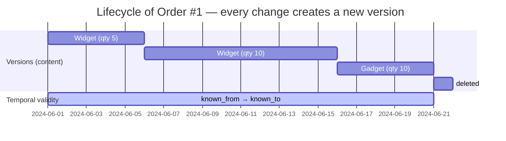
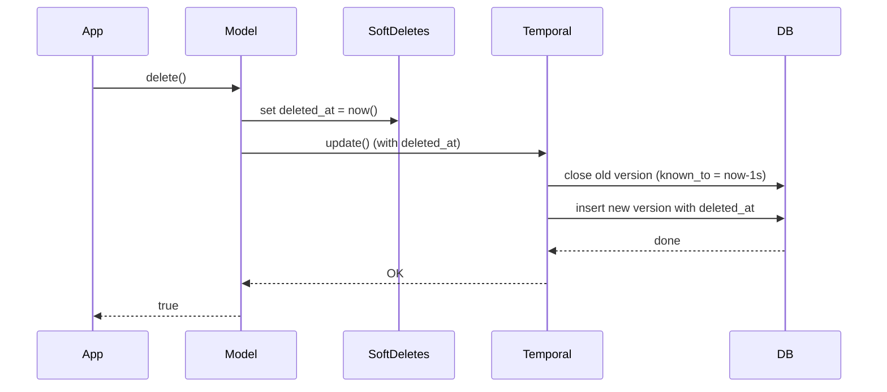

# Uni-Temporal (Transaction Time Versioning)

## What is temporal storage?

A normal database table stores only the **current state** of a record. When you update or delete a record, the previous values are gone forever.

**Temporal storage** preserves every version. Every change creates a new entry — the old one remains intact and queryable.

### Uni-Temporal (one time axis)

Each record gains two additional columns:

| Column | Meaning | Example |
|--------|---------|---------|
| `known_from` | When this version became active | `2024-06-01 10:00:00` |
| `known_to` | When this version was superseded | `2024-06-10 14:30:00` |
| Max-sentinel | Marks the currently active version | `9999-12-31 23:59:59` |

**Current version**: `known_to = 9999-12-31 23:59:59`  
**Historical version**: `known_to` is a past timestamp  
**Deleted record**: the last version has `known_to = deletion time − 1 microsecond` (unless using SoftDeletes)



---

## Installation

```bash
composer require guggach/laravel-db-temporal
```

Set up the `temporal-proxy` connection in your `config/database.php`:

```bash
php artisan temporal:install
```

This reads your current default connection (e.g. `mysql`), sets it as `base`, and switches the default to `temporal`. All non-temporal tables pass through unchanged.

To undo:

```bash
php artisan temporal:uninstall
```

---

## Configuration

Laravel provides two ways to interact with the database: **connection-based** (`DB::table()`) and **Eloquent-based** (models). This package supports both. If you only use Eloquent, no connection config is required — the trait defaults to `known_from` / `known_to`. Column names can also be overridden on the model.

> **Warning:** If you skip the connection config, never call `DB::table()` on temporal tables — it will silently corrupt the history. Use Eloquent models instead.

> **Recommendation:** Always define your temporal tables in the connection config, even if you primarily use Eloquent. Setting `temporal` as the default connection is the safest approach — non-temporal tables pass through unchanged.

### Connection-based (`DB::table()`) — recommended

The connection config in `config/database.php` defines which tables are temporal and their column names. **All unlisted tables pass through unchanged.**

**Simplest case** — default column names (`known_from` / `known_to`):

```php
// config/database.php
'default' => env('DB_CONNECTION', 'temporal'),

'connections' => [
    'temporal' => [
        'driver' => 'temporal-proxy',
        'base'   => 'mysql',  // or: pgsql, sqlite

        'uni-temporal' => [
            'defaults' => [
                'column_from'   => 'known_from',
                'column_to'     => 'known_to',
                'max_timestamp' => '9999-12-31 23:59:59',
            ],
            'tables' => [
                'orders'   => [],  // uses defaults
                'articles' => [],  // uses defaults
            ],
        ],
    ],
],
```

`host`, `port`, `database`, `username`, and `password` are inherited from the `base` connection.

`'orders' => []` (empty array) means: temporal table using the default column names.

**With custom column names:**

```php
'uni-temporal' => [
    'defaults' => [
        'column_from' => 'known_from',
        'column_to'   => 'known_to',
    ],
    'tables' => [
        'orders'   => [],               // known_from / known_to
        'invoices' => [                 // custom names
            'column_from' => 'sys_from',
            'column_to'   => 'sys_to',
        ],
    ],
],
```

`INSERT`, `UPDATE`, and `DELETE` on listed tables are now automatically versioned:

```php
DB::table('orders')->insert(['product' => 'Widget', 'quantity' => 5]);

DB::table('orders')->where('id', 1)->update(['quantity' => 10]);

DB::table('orders')->where('id', 1)->delete();
```

### Eloquent model

Add the `IsUniTemporal` trait and implement the `UniTemporalModel` interface:

```php
use Guggach\LaravelDbTemporal\Eloquent\IsUniTemporal;
use Guggach\LaravelDbTemporal\Eloquent\UniTemporalModel;

class Order extends Model implements UniTemporalModel
{
    use IsUniTemporal;
    public $incrementing = false;
}
```

### Column name resolver (first match wins)

1. Model constants: `COLUMN_TRX_DATE_FROM`, `COLUMN_TRX_DATE_TO`, `MAX_TIMESTAMP`
2. Table config: `uni-temporal.tables.<table>.column_from`
3. Connection defaults: `uni-temporal.defaults.column_from`
4. Hardcoded fallback: `known_from` / `known_to` / `9999-12-31 23:59:59`

```php
class Order extends Model implements UniTemporalModel
{
    use IsUniTemporal;

    const COLUMN_TRX_DATE_FROM = 'sys_from';
    const COLUMN_TRX_DATE_TO   = 'sys_to';
    const MAX_TIMESTAMP        = '9999-12-31 23:59:59';
}
```

---

## Database schema

### Blueprint macros

| Macro | Description |
|-------|-------------|
| `$table->unitemporal()` | Adds `dateTime` columns for `column_from` and `column_to` from the connection defaults |
| `$table->unitempIndexes($pk = 'id')` | Creates composite primary key `(pk, column_from, column_to)` and a composite index on `(column_to, pk)` |

**Standard case:**

```php
Schema::create('orders', function (Blueprint $table) {
    $table->unsignedBigInteger('id');
    $table->unitemporal();
    $table->string('product');
    $table->integer('quantity');
    $table->timestamps();

    $table->unitempIndexes();
});
```

Creates: `known_from datetime`, `known_to datetime`, primary key `(id, known_from, known_to)`, and a composite index on `(known_to, id)`.

**With a custom primary key (e.g. UUID):**

```php
Schema::create('orders', function (Blueprint $table) {
    $table->uuid('uuid');
    $table->unitemporal();
    $table->string('product');
    $table->integer('quantity');
    $table->timestamps();

    $table->unitempIndexes('uuid');
});
```

> Use `unsignedBigInteger('id')` instead of `id()` — the 3-column composite PK replaces the standard auto-increment PK.

### Manual migration (without macros)

```php
Schema::create('orders', function (Blueprint $table) {
    $table->unsignedBigInteger('id');
    $table->dateTime('known_from');
    $table->dateTime('known_to');
    $table->string('product');
    $table->integer('quantity');
    $table->timestamps();

    $table->primary(['id', 'known_from', 'known_to']);
    $table->index(['known_to', 'id']);
});
```

### Column types

| Type | Recommendation | Note |
|------|---------------|------|
| `dateTime` | `known_from`, `known_to` | Second-precision, standard |
| `timestamp` | Alternative | MySQL converts to UTC; may cause issues with the max value |
| `dateTimeTz` | Multi-timezone | Increases complexity; only needed for absolute timezone clarity |

---

## Scenario: An order over its lifecycle

A web shop order that is changed multiple times.

### Day 1 — Order is created

```php
Order::create(['id' => 1, 'product' => 'Widget', 'quantity' => 5]);
```

| id | product | quantity | known_from | known_to |
|----|---------|----------|------------|----------|
| 1 | Widget | 5 | 2024-06-01 10:00:00 | 9999-12-31 23:59:59 |

One row. `known_to = max` → this is the current version.

### Day 6 — Quantity change from 5 to 10

```php
$order->update(['quantity' => 10]);
```

Under the hood: close the current version, insert a new one.

| id | product | quantity | known_from | known_to | status |
|----|---------|----------|------------|----------|--------|
| 1 | Widget | 5 | 2024-06-01 10:00:00 | **2024-06-06 09:15:00** | historical |
| 1 | Widget | **10** | **2024-06-06 09:15:01** | 9999-12-31 23:59:59 | **current** |

### Day 16 — Product change from Widget to Gadget

Same principle: close old version, create new version.

| id | product | quantity | known_from | known_to | status |
|----|---------|----------|------------|----------|--------|
| 1 | Widget | 5 | 2024-06-01 | 2024-06-06 | historical |
| 1 | Widget | 10 | 2024-06-06 | **2024-06-16** | historical |
| 1 | **Gadget** | **10** | **2024-06-16** | 9999-12-31 | **current** |

### Day 21 — Order is deleted

Temporal delete closes the current version — no physical `DELETE`.

```php
$order->delete();
```

| id | product | quantity | known_from | known_to | status |
|----|---------|----------|------------|----------|--------|
| 1 | Widget | 5 | 2024-06-01 | 2024-06-06 | historical |
| 1 | Widget | 10 | 2024-06-06 | 2024-06-16 | historical |
| 1 | Gadget | 10 | 2024-06-16 | **2024-06-21** | **deleted** |

Order 1 no longer has a version with `known_to = max`. It is invisible from the current-state perspective — but the full history remains.

---

## Querying temporal data

### Default: current version only

```php
Order::where('product', 'Gadget')->get(); // empty — Gadget version is deleted
Order::all()->count();                    // 0
```

The global scope automatically adds `WHERE known_to = '9999-12-31 23:59:59'`.

### All versions (history)

```php
$history = Order::allVersions()->where('id', 1)->get();
// 3 records: original + 2 updates
```

### Version at a specific point in time

```php
$version = Order::versionAsOf('2024-06-10')->where('id', 1)->first();
// product = Widget, quantity = 10
```

### Versions in a time window

**`versionsInRange($from, $to)`** — only versions fully within the window:

```php
Order::versionsInRange('2024-06-05', '2024-06-20')->where('id', 1)->get();
```

| version | from | to | in window? |
|---------|------|----|-----------|
| Widget/5 | 2024-06-01 | 2024-06-06 | ❌ (starts before window) |
| Widget/10 | 2024-06-06 | 2024-06-16 | ✅ |
| Gadget/10 | 2024-06-16 | 2024-06-21 | ✅ |

**`versionsTouchedRange($from, $to)`** — versions that overlap the window:

```php
Order::versionsTouchedRange('2024-06-05', '2024-06-20')->where('id', 1)->get();
```

| version | from | to | overlaps? |
|---------|------|----|----------|
| Widget/5 | 2024-06-01 | 2024-06-06 | ✅ (ends within) |
| Widget/10 | 2024-06-06 | 2024-06-16 | ✅ |
| Gadget/10 | 2024-06-16 | 2024-06-21 | ✅ (starts within) |

### First / last version

```php
$first = Order::firstVersion()->where('id', 1)->first(); // Widget, qty 5
$last  = Order::latestVersion()->where('id', 1)->first(); // Gadget, qty 10
```

---

## API reference

### Eloquent scope methods

| Method | Description |
|--------|-------------|
| `allVersions()` | Removes global scope — all versions visible |
| `currentVersion()` | Restores global scope (after `withoutGlobalScope`) |
| `firstVersion()` | `ORDER BY known_to ASC` → earliest version |
| `latestVersion()` | `ORDER BY known_to DESC` → latest version (may be deleted) |
| `versionAsOf($datetime)` | Version at a given point in time |
| `versionsInRange($from, $to)` | Versions fully within a time window |
| `versionsTouchedRange($from, $to)` | Versions overlapping a time window |
| `deletedSince($datetime = null)` | Records with no current version, optionally filtered by date |
| `skipVersioning()` | Admin: disable versioning for this query |
| `resumeVersioning()` | Admin: re-enable versioning |

### Builder methods (`DB::table()`)

```php
// Insert — sets known_from = NOW() and known_to = MAX
DB::table('orders')->insert(['product' => 'Widget', 'quantity' => 5]);

// insertGetId — uses MAX(id) + 1; use ULIDs/UUIDs under high concurrency
$id = DB::table('orders')->insertGetId(['product' => 'Widget', 'quantity' => 5]);

// Update — closes current version, opens new one
DB::table('orders')->where('id', 1)->update(['quantity' => 10]);

// Delete — sets known_to = now − 1s; no physical DELETE
DB::table('orders')->where('id', 1)->delete();

// Admin: bypass versioning
DB::table('orders')->skipVersioning()->where('id', 1)->update(['quantity' => 5]);
```

---

## SoftDeletes

`SoftDeletes` and temporal versioning work together — the soft delete flows through the normal `update()` path, so a new TT-version with `deleted_at` is created automatically.

```php
class Order extends Model implements UniTemporalModel
{
    use IsUniTemporal;
    use SoftDeletes;
}
```

```php
Schema::create('orders', function (Blueprint $table) {
    $table->unsignedBigInteger('id');
    $table->dateTime('known_from');
    $table->dateTime('known_to');
    $table->string('product');
    $table->integer('quantity');
    $table->softDeletes();
    $table->timestamps();

    $table->primary(['id', 'known_from', 'known_to']);
});
```

When `$order->delete()` is called:

1. `SoftDeletes` sets `deleted_at = now()` on the model
2. The normal `update()` path runs → temporal versioning
3. Old version is closed, new version with `deleted_at` is inserted



Two scopes work together:
- `UniTemporalScope`: `WHERE known_to = max` → current TT-version
- `SoftDeletes`: `WHERE deleted_at IS NULL` → hides the deleted record

```php
Customer::find(100);              // null (hidden by SoftDeletes)
Customer::withTrashed()->find(100); // found — current version with deleted_at
Customer::allVersions()->where('id', 100)->get(); // full history
```

---

## Best practices

1. **Set `temporal` as the default connection** — non-temporal tables pass through; temporal tables are protected.
2. **Primary key = `(id, known_from, known_to)`** — guarantees uniqueness across all versions.
3. **Composite index on `(known_to, id)`** — optimally covers `WHERE known_to = max AND id = X`.
4. **Use ULIDs or UUIDs** instead of `insertGetId` under high concurrency.
5. **Keep `skipVersioning()` for admin corrections only** — never in normal business logic.
