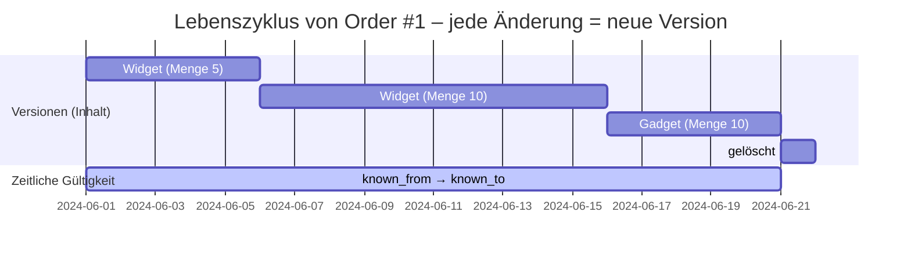
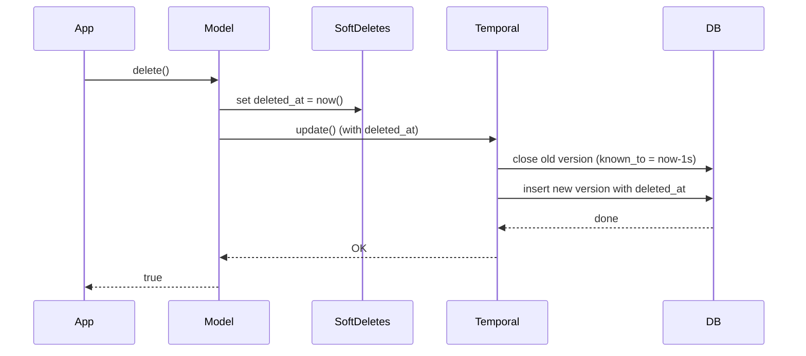
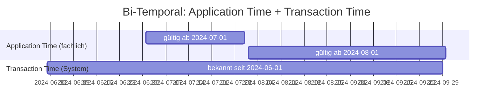

# Uni-Temporal (Transaction Time Versioning)

## Was ist temporales Storage?

Eine normale Datenbanktabelle speichert nur den **aktuellen Zustand** eines Datensatzes. Wenn du einen Datensatz änderst oder löschst, sind die vorherigen Werte unwiderruflich verloren.

Ein **temporales Speicher** behält dagegen **alle Versionen** eines Datensatzes. Jede Änderung erzeugt einen neuen Eintrag – der alte bleibt für die Nachwelt erhalten.

### Uni-Temporal (eine Zeitachse)

Jeder Datensatz bekommt zwei zusätzliche Spalten:

| Spalte | Bedeutung | Beispiel |
|--------|-----------|----------|
| `known_from` | Zeitpunkt, ab dem diese Version gültig wurde | `2024-06-01 10:00:00` |
| `known_to` | Zeitpunkt, bis zu dem diese Version gültig war | `2024-06-10 14:30:00` |
| Max-Sentinel | Markiert die aktuell gültige Version | `9999-12-31 23:59:59` |

**Aktuelle Version**: `known_to = 9999-12-31 23:59:59`
**Historische Version**: `known_to` ist ein vergangener Zeitpunkt
**Gelöschter Datensatz**: Die letzte Version bekommt `known_to = Löschzeitpunkt - 1 Sekunde` (sofern du nicht SoftDeletes nutzt)



---

## Installation

```bash
composer require guggach/laravel-db-temporal
```

Danach kannst du die `temporal-proxy`-Connection automatisch in deine `config/database.php` einrichten lassen:

```bash
php artisan temporal:install
```

Der Befehl liest deine aktuelle Default-Connection (z.B. `mysql`), setzt sie als `base` und wechselt den Default auf `temporal`. Alle nicht-temporalen Tabellen passieren unverändert.

Zum Rückgängigmachen:

```bash
php artisan temporal:uninstall
```

---

## Konfiguration und Anwendung

Laravel hat zwei Wege wie Datenbanken bearbeitet werden, nämlich **Connection-basiert** (`DB::table()`) und **Eloquent-basiert** (Models). Dieses Paket unterstützt beide Wege. Wenn du nur Eloquent nutzt, brauchst du keine Connection-Config – der Trait verwendet automatisch die Standard-Spaltennamen `known_from` / `known_to`. Du kannst die Namen auch im Model überschreiben.

**Warnung!**: Wenn du auf die Connection-basierte Konfiguration verzichtest, dann darfst du `DB::table()` nur auf Tabellen anwenden, die **nicht** temporales Verhalten haben. Die Gefahr ist maximal gross, dass die Historie von temporalen Tabellen zerstört wird.

**Empfehlung:** Definiere die temporalen Tabellen in der Connection-Config, auch wenn du grundsätzlich nur Eloquent nutzt. Dann ist die Historie gesichert. Am besten setzt du die `temporal`-Connection gleich als **Default** – nicht-temporale Tabellen passieren unverändert.

### Connection-basiert (`DB::table()`) – empfohlen

Die Connection-Config in `config/database.php` definiert, welche Tabellen temporal sind und welche Column-Namen sie verwenden. **Alle nicht gelisteten Tabellen passieren unverändert.**

**Einfachster Fall** – nur die Default-Spaltennamen (`known_from` / `known_to`):

```php
// config/database.php
'default' => env('DB_CONNECTION', 'temporal'),

'connections' => [
    'temporal' => [
        'driver' => 'temporal-proxy',
        'base'   => 'mysql',          // oder: pgsql, sqlite

        'uni-temporal' => [
            'defaults' => [
                'column_from' => 'known_from',
                'column_to'   => 'known_to',
                'max_timestamp' => '9999-12-31 23:59:59',
            ],
            'tables' => [
                'orders' => [],        // verwendet defaults
                'articles' => [],     // verwendet defaults
            ],
        ],
    ],
],
```

`host`, `port`, `database`, `username`, `password` werden von der `base`-Connection übernommen – du brauchst sie hier nicht.

`'orders' => []` (leeres Array) bedeutet: Tabelle ist temporal mit den Default-Namen. Das ist der häufigste Fall.

**Mit abweichenden Column-Namen:**

```php
'uni-temporal' => [
    'defaults' => [
        'column_from' => 'known_from',
        'column_to'   => 'known_to',
    ],
    'tables' => [
        'orders' => [],                   // known_from / known_to
        'invoices' => [                   // abweichende Namen
            'column_from' => 'sys_from',
            'column_to'   => 'sys_to',
        ],
    ],
],
```

**Wichtig:** Nicht-temporale Tabellen (`users`, `password_resets`, `migrations`) werden **nicht versioniert** – sie arbeiten wie gewohnt. Die `temporal`-Connection ist ein Vollersatz für die Standard-Connection.

Jetzt werden `INSERT`, `UPDATE`, `DELETE` auf gelisteten Tabellen automatisch versioniert:

```php
DB::table('orders')->insert([
    'product' => 'Widget', 'quantity' => 5
]);

DB::table('orders')->where('id', 1)->update([
    'quantity' => 10
]);

DB::table('orders')->where('id', 1)->delete();
```

### Eloquent-basiert (Model) – nur Trait

Füge den `IsUniTemporal`-Trait zu deinem Model hinzu – ohne Connection-Config verwendest du die Defaults `known_from` / `known_to`:

```php
use Guggach\LaravelDbTemporal\Eloquent\IsUniTemporal;

class Order extends Model
{
    use IsUniTemporal;

    public $incrementing = false;
}
```

### Column-Namen Auflösung (Resolver-Kette)

Der Trait und der Builder lesen Column-Namen aus diesen Quellen (erster Treffer gewinnt):

1. **Model-Konstanten**: `COLUMN_TRX_DATE_FROM`, `COLUMN_TRX_DATE_TO`, `MAX_TIMESTAMP`
2. **Table-Config**: `uni-temporal.tables.<table>.column_from` (pro Tabelle in der Connection)
3. **Connection-Defaults**: `uni-temporal.defaults.column_from`
4. **Hardcoded Fallback**: `known_from` / `known_to` / `9999-12-31 23:59:59`

```php
class Order extends Model
{
    use IsUniTemporal;

    const COLUMN_TRX_DATE_FROM = 'sys_from';
    const COLUMN_TRX_DATE_TO   = 'sys_to';
    const MAX_TIMESTAMP        = '9999-12-31 23:59:59';
}
```

### Datenbank-Schema (Migration)

Das Paket stellt zwei **Blueprint-Makros** für Migrationen bereit:

| Makro | Beschreibung |
|-------|-------------|
| `$table->unitemporal()` | Fügt `dateTime`-Spalten für `column_from` und `column_to` aus den Connection-Defaults hinzu |
| `$table->unitempIndexes($pk = 'id')` | Legt den zusammengesetzten Primärschlüssel `(pk, column_from, column_to)` und einen Index auf `column_to` an |

**Standardfall – einfach und komplett:**

```php
Schema::create('orders', function (Blueprint $table) {
    $table->unsignedBigInteger('id');
    $table->unitemporal();
    $table->string('product');
    $table->integer('quantity');
    $table->timestamps();

    $table->unitempIndexes();
});
```

Erzeugt: `known_from datetime`, `known_to datetime`, Primärschlüssel `(id, known_from, known_to)` und Index auf `known_to`.

**Mit abweichendem Primärschlüssel (z.B. UUID):**

```php
Schema::create('orders', function (Blueprint $table) {
    $table->uuid('uuid');
    $table->unitemporal();
    $table->string('product');
    $table->integer('quantity');
    $table->timestamps();

    $table->unitempIndexes('uuid');
});
```

**Wichtig:** Verwende `unsignedBigInteger('id')` statt `id()` (auto-increment), da der Primärschlüssel aus drei Spalten besteht. `id()` würde einen eigenen auto-increment-PK setzen, der mit dem composite-PK kollidiert.

#### Ohne Makros (manuell)

```php
Schema::create('orders', function (Blueprint $table) {
    $table->unsignedBigInteger('id');
    $table->dateTime('known_from');
    $table->dateTime('known_to');
    $table->string('product');
    $table->integer('quantity');
    $table->timestamps();

    $table->primary(['id', 'known_from', 'known_to']);
    $table->index('known_to');
});
```

#### Benutzerdefinierte Column-Namen

Die Makros lesen die Defaults aus der Config der **Default-Datenbankverbindung** unter `uni-temporal.defaults`:

```php
// config/database.php
'connections' => [
    'mysql' => [
        'driver' => 'mysql',
        // …
        'uni-temporal' => [
            'defaults' => [
                'column_from' => 'sys_from',
                'column_to'   => 'sys_to',
                'max_date'    => '9999-12-31 23:59:59',
            ],
        ],
    ],
],
```

```php
Schema::create('invoices', function (Blueprint $table) {
    $table->unsignedBigInteger('id');
    $table->unitemporal();
    // …
    $table->unitempIndexes();
});
```

Erzeugt dann `sys_from datetime`, `sys_to datetime` und den PK `(id, sys_from, sys_to)`.

**Ohne Connection-Defaults** (oder weicht nur eine einzelne Migration ab) die Makros nicht verwenden – manuell schreiben:

```php
Schema::create('invoices', function (Blueprint $table) {
    $table->unsignedBigInteger('id');
    $table->dateTime('sys_from');
    $table->dateTime('sys_to');
    $table->string('title');
    $table->timestamps();

    $table->primary(['id', 'sys_from', 'sys_to']);
    $table->index('sys_to');
});
```

#### Column-Typen

| Typ | Empfehlung | Hinweis |
|-----|-----------|---------|
| `dateTime` | `known_from`, `known_to` | Sekundengenau, Standard |
| `timestamp` | Alternative | MySQL konvertiert in UTC, kann bei max-Wert Probleme geben |
| `dateTimeTz` | Für multi-timezone | Erhöht Komplexität, nur nötig wenn absolute Klarheit |

---

## Szenario: Ein Auftrag über seinen Lebenszyklus

Nehmen wir einen Webshop-Auftrag, der über die Zeit mehrfach geändert wird.

### 1. Tag 1 – Auftrag wird erfasst

```sql
INSERT INTO orders (id, product, quantity, known_from, known_to)
VALUES (1, 'Widget', 5, '2024-06-01 10:00:00', '9999-12-31 23:59:59');
```

**Tabelle `orders`:**

| id | product | quantity | known_from | known_to |
|----|---------|----------|------------|----------|
| 1  | Widget  | 5        | 2024-06-01 10:00:00 | 9999-12-31 23:59:59 |

Eine Zeile. `known_to = max` → das ist die aktuelle Version.

### 2. Tag 6 – Mengenänderung von 5 auf 10

Normalerweise ein `UPDATE`. Temporal passiert Folgendes:

**Schritt 1:** Die aktuelle Version wird *geschlossen*:
```sql
UPDATE orders SET known_to = '2024-06-06 09:15:00'
WHERE id = 1 AND known_to = '9999-12-31 23:59:59';
```

**Schritt 2:** Eine *neue Version* wird eingefügt:
```sql
INSERT INTO orders (id, product, quantity, known_from, known_to)
VALUES (1, 'Widget', 10, '2024-06-06 09:15:01', '9999-12-31 23:59:59');
```

**Tabelle `orders` nach dem Update:**

| id | product | quantity | known_from | known_to | Status |
|----|---------|----------|------------|----------|--------|
| 1  | Widget  | 5        | 2024-06-01 10:00:00 | **2024-06-06 09:15:00** | historisch |
| 1  | Widget  | **10**   | **2024-06-06 09:15:01** | 9999-12-31 23:59:59 | **aktuell** |

Zwei Zeilen. Die alte Version ist geschlossen, die neue ist aktiv.

### 3. Tag 16 – Produktwechsel von Widget auf Gadget

Gleiches Prinzip: alte Version schliessen, neue Version erzeugen.

| id | product | quantity | known_from | known_to | Status |
|----|---------|----------|------------|----------|--------|
| 1  | Widget  | 5        | 2024-06-01 10:00:00 | 2024-06-06 09:15:00 | historisch |
| 1  | Widget  | 10       | 2024-06-06 09:15:01 | **2024-06-16 11:30:00** | historisch |
| 1  | **Gadget** | **10** | **2024-06-16 11:30:01** | 9999-12-31 23:59:59 | **aktuell** |

Drei Zeilen, drei Versionen desselben Auftrags.

### 4. Tag 21 – Auftrag wird gelöscht

Temporal löschen schliesst die aktuelle Version – kein physisches `DELETE`.

```sql
UPDATE orders SET known_to = '2024-06-21 08:00:00'
WHERE id = 1 AND known_to = '9999-12-31 23:59:59';
```

| id | product | quantity | known_from | known_to | Status |
|----|---------|----------|------------|----------|--------|
| 1  | Widget  | 5        | 2024-06-01 10:00:00 | 2024-06-06 09:15:00 | historisch |
| 1  | Widget  | 10       | 2024-06-06 09:15:01 | 2024-06-16 11:30:00 | historisch |
| 1  | Gadget  | 10       | 2024-06-16 11:30:01 | **2024-06-21 08:00:00** | **gelöscht** |

Jetzt hat Auftrag 1 **keine** Version mehr mit `known_to = max`.
Er ist aus Sicht der Gegenwart nicht mehr sichtbar – aber die gesamte Historie existiert weiter.

---

## Abfragen auf temporalen Daten

### Standard: Nur die aktuelle Version

```php
Order::where('product', 'Gadget')->get();
```

Resultat: **leer** – denn die Gadget-Version ist gelöscht (`known_to` != max).
Der Global Scope fügt automatisch `WHERE known_to = '9999-12-31 23:59:59'` hinzu.

```php
Order::all()->count(); // 0 – keine aktuelle Version
```

### Alle Versionen (Historie)

```php
$history = Order::allVersions()->where('id', 1)->get();
// 3 Datensätze: die ursprüngliche + 2 Änderungen
```

| # | product | quantity | known_from | known_to | Status |
|---|---------|----------|------------|----------|--------|
| 1 | Widget  | 5        | 2024-06-01 | 2024-06-06 | erste Version |
| 2 | Widget  | 10       | 2024-06-06 | 2024-06-16 | erste Änderung |
| 3 | Gadget  | 10       | 2024-06-16 | 2024-06-21 | zweite Änderung (dann gelöscht) |

### Version zu einem bestimmten Zeitpunkt

```php
$version = Order::versionAsOf('2024-06-10')->where('id', 1)->first();
// product = Widget, quantity = 10
// Das war am 10. Juni der aktuelle Stand
```

### Versionen in einem Zeitfenster

**`versionsInRange(from, to)`** – nur Versionen, die *vollständig* im Fenster liegen:

```php
Order::versionsInRange('2024-06-05', '2024-06-20')->where('id', 1)->get();
```

| Version | from | to | Im Fenster? |
|---------|------|----|------------|
| Widget/5 | 2024-06-01 | 2024-06-06 | ❌ (beginnt vor dem Fenster) |
| Widget/10 | 2024-06-06 | 2024-06-16 | ✅ |
| Gadget/10 | 2024-06-16 | 2024-06-21 | ✅ |

**`versionsTouchedRange(from, to)`** – Versionen, die das Fenster *überlappen*:

```php
Order::versionsTouchedRange('2024-06-05', '2024-06-20')->where('id', 1)->get();
```

| Version | from | to | Überlappt? |
|---------|------|----|------------|
| Widget/5 | 2024-06-01 | 2024-06-06 | ✅ (endet innerhalb) |
| Widget/10 | 2024-06-06 | 2024-06-16 | ✅ |
| Gadget/10 | 2024-06-16 | 2024-06-21 | ✅ (beginnt innerhalb) |

### Erste / Letzte Version

```php
$first = Order::firstVersion()->where('id', 1)->first();
// Widget, 5 Stück – die ursprüngliche Erfassung

$last = Order::latestVersion()->where('id', 1)->first();
// Gadget, 10 Stück – die letzte Version (evtl. gelöscht)
```

---

## API-Referenz

### Eloquent-Methoden (IsUniTemporal Trait)

#### `allVersions()`

Entfernt den Global Scope – alle Versionen (aktuell + historisch) sind sichtbar.

```php
Order::allVersions()->where('id', 1)->get();
// Alle 3 Versionen von Order #1
```

#### `currentVersion()`

Stellt den Global Scope wieder her (nach `withoutGlobalScope`).

```php
Order::allVersions()->currentVersion()->where('id', 1)->get();
// Nur die aktive Version
```

#### `firstVersion()`

Sortiert nach `known_to ASC` → die früheste (ursprünglichste) Version.

```php
Order::firstVersion()->where('id', 1)->first();
// Widget, 5 Stück
```

#### `latestVersion()`

Sortiert nach `known_to DESC` → die letzte Version (kann gelöscht sein).

```php
Order::latestVersion()->where('id', 1)->first();
// Gadget, 10 Stück
```

#### `versionAsOf($datetime)`

Version zu einem bestimmten Zeitpunkt (`known_from <= dt <= known_to`).

```php
Order::versionAsOf('2024-06-10')->where('id', 1)->first();
// Widget, 10 Stück

Order::versionAsOf(Carbon::parse('2024-06-10 12:00:00'))->first();
```

#### `versionsInRange($from, $to)`

Versionen, die **vollständig** innerhalb eines Zeitraums liegen (`known_from >= from AND known_to <= to`).

```php
Order::versionsInRange('2024-06-05', '2024-06-20')->get();
```

#### `versionsTouchedRange($from, $to)`

Versionen, die einen Zeitraum **überlappen** (`known_to >= from AND known_from <= to`).

```php
Order::versionsTouchedRange('2024-06-05', '2024-06-20')->get();
```

### Builder-Methoden (UniTemporalBuilder)

Diese Methoden stehen sowohl auf dem Eloquent-Query-Builder als auch auf `DB::table()` zur Verfügung.

#### `insert(array $values): bool`

Fügt einen neuen Datensatz mit `known_from = now` und `known_to = max` ein.

```php
DB::table('orders')->insert([
    'product' => 'Widget', 'quantity' => 5
]);
// known_from = NOW(), known_to = 9999-12-31 23:59:59
```

Bei Eloquent setzt der Trait die Timestamps selbst – der Builder überspringt dann das Setzen.

#### `insertGetId(array $values, $sequence = 'id'): int`

Wie `insert()`, ermittelt aber die nächste ID via `MAX(id) + 1`.

```php
$id = DB::table('orders')->insertGetId([
    'product' => 'Widget', 'quantity' => 5
]);
// $id = 1
```

**Hinweis:** Bei hohem Concurrency-Aufkommen kann diese Methode Race Conditions verursachen. Verwende in Produktion ULIDs oder UUIDs als Primärschlüssel.

#### `update(array $values): int`

Schliesst die aktuelle Version (`known_to = now - 1s`) und fügt eine neue Version mit den geänderten Werten ein.

```php
DB::table('orders')->where('id', 1)->update([
    'quantity' => 10
]);
```

#### `delete($id = null): int`

Setzt `known_to = now - 1s` auf die aktuelle Version – kein physischer `DELETE`.

```php
DB::table('orders')->where('id', 1)->delete();
// oder
DB::table('orders')->delete(1);
```

#### `skipVersioning()` / `resumeVersioning()`

Deaktiviert/reaktiviert die Versionierung für Admin-Eingriffe (z.B. Korrekturen an der Historie).

```php
DB::table('orders')
    ->skipVersioning()
    ->where('id', 1)
    ->update(['quantity' => 5]);
// Nur ein normales UPDATE – keine Versionierung
```

### Zusammenfassung der Abfrage-Methoden

| Methode | Beschreibung |
|---------|------------|
| `allVersions()` | Entfernt den Global Scope – zeigt die ganze Historie |
| `currentVersion()` | Stellt den Global Scope wieder her (nach `withoutGlobalScope`) |
| `firstVersion()` | Sortiert nach `known_to ASC` → früheste Version |
| `latestVersion()` | Sortiert nach `known_to DESC` → letzte Version (kann gelöscht sein) |
| `versionAsOf($datetime)` | Version zu einem bestimmten Zeitpunkt |
| `versionsInRange($from, $to)` | Versionen vollständig innerhalb eines Zeitraums |
| `versionsTouchedRange($from, $to)` | Versionen, die einen Zeitraum überlappen |
| `skipVersioning()` | Admin: Versionierung für diesen Query deaktivieren |
| `resumeVersioning()` | Admin: Versionierung wieder aktivieren |

---

## SoftDeletes: Zwei Lösch-Konzepte kombiniert

Laravel's `SoftDeletes` und temporales Versioning lassen sich kombinieren:

```php
use Guggach\LaravelDbTemporal\Eloquent\IsUniTemporal;
use Illuminate\Database\Eloquent\SoftDeletes;

class Order extends Model
{
    use IsUniTemporal;
    use SoftDeletes;
}
```

**Migration:**

```php
Schema::create('orders', function (Blueprint $table) {
    $table->unsignedBigInteger('id');
    $table->dateTime('known_from');
    $table->dateTime('known_to');
    $table->string('product');
    $table->integer('quantity');
    $table->softDeletes(); // deleted_at
    $table->timestamps();

    $table->primary(['id', 'known_from', 'known_to']);
});
```

### Was passiert bei `$order->delete()`?

Der Soft-Delete durchläuft die **normale temporale Versionierung** – es wird eine neue Version erzeugt:

**Vor dem Löschen (ein Record):**

| id | name | known_from | known_to | deleted_at |
|----|------|------------|----------|------------|
| 100 | Muster | 2026-07-25 10:00:00 | 9999-12-31 23:59:59 | null |

**`$customer->delete()` löst aus:**

1. `SoftDeletes` setzt `deleted_at = now()` auf dem Model
2. Der normale `update()`-Weg wird durchlaufen → temporale Versionierung
3. Die alte Version wird geschlossen, eine neue Version mit `deleted_at` wird eingefügt



**Resultat in der DB:**

| id | name | known_from | known_to | deleted_at |
|----|------|------------|----------|------------|
| 100 | Muster | 2026-07-25 10:00:00 | **2026-08-31 13:59:59** | null |
| 100 | Muster | **2026-08-31 14:00:00** | 9999-12-31 23:59:59 | **2026-08-31 14:00:00** |

**Zwei Scopes wirken zusammen:**
- `UniTemporalScope`: `WHERE known_to = max` → Version 2 ist die aktuelle
- `SoftDeletes`: `WHERE deleted_at IS NULL` → Version 2 ist versteckt

Effekt: Der Kunde ist aus normalen Queries verschwunden, aber die Historie zeigt klar, wann er existierte und wann gelöscht wurde.

```php
Customer::find(100); // null (SoftDeletes versteckt ihn)

Customer::withTrashed()->find(100);
// gefunden – aktuellste Version mit deleted_at

Customer::allVersions()->where('id', 100)->get();
// 2 Records: die aktive Zeit + der gelöschte Zustand
```

---

## Best Practices

1. **Immer `temporal` als Default-Connection** – nicht-temporale Tabellen passieren unverändert, temporale sind geschützt
2. **Primärschlüssel = `(id, known_from, known_to)`** – die Kombination garantiert Eindeutigkeit
3. **Index auf `known_to`** – jeder normale Query hat ein `WHERE known_to = max`
4. **Kein auto-increment bei `insertGetId`** – bei Concurrency-Problemen ULIDs/UUIDs verwenden
5. **`skipVersioning` nur für Admin-Korrekturen** – nie in der normalen Geschäftslogik

---

## Ausblick: Bi-Temporal (zwei Zeitachsen)



Bi-temporales Storage erweitert uni-temporales um eine **zweite, fachliche Zeitachse** (Application Time / Valid Time). Mehr dazu in einer späteren Version.
